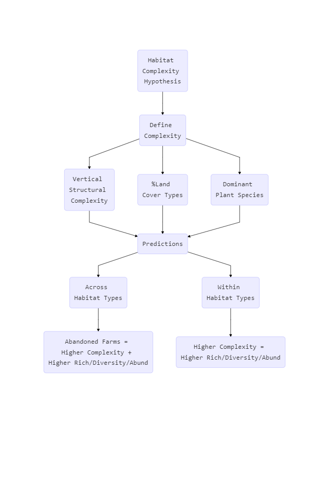

```{r setup, include=FALSE}
library(knitr)
knitr::opts_chunk$set(echo = TRUE)
```

###DipSwitch Table

```{r, include = F}
dstable<-read.csv(file = "DipSwitchTable.csv")
```

```{r, echo = F, results='asis'}
kable(dstable)
```

###Logic Tree
Based on the literature, abandoned farms should have the highest species richness, abundance, and diversity due to increased habitat complexity. The following tree is a method for testing the habitat complexity hypothesis.  

